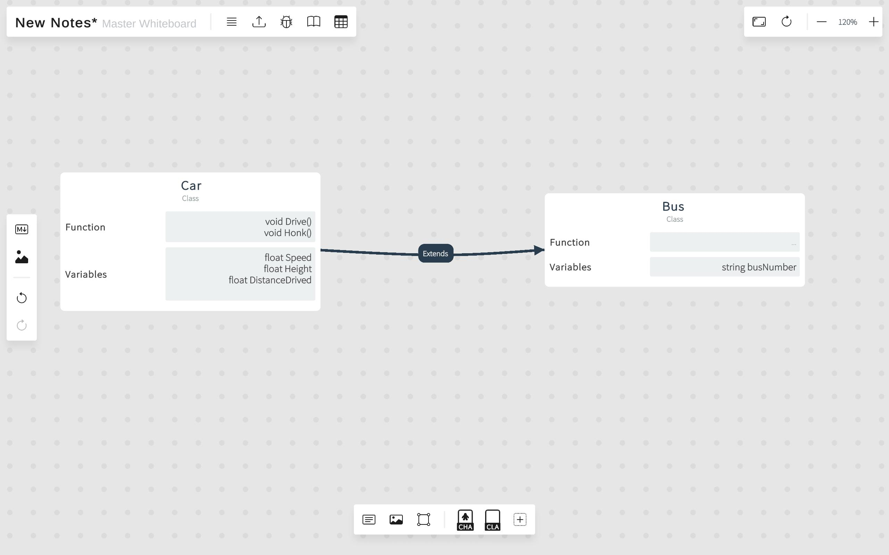
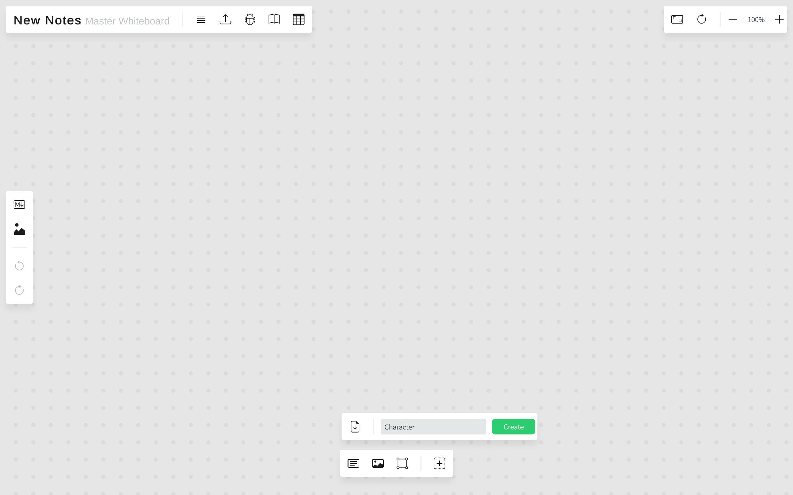
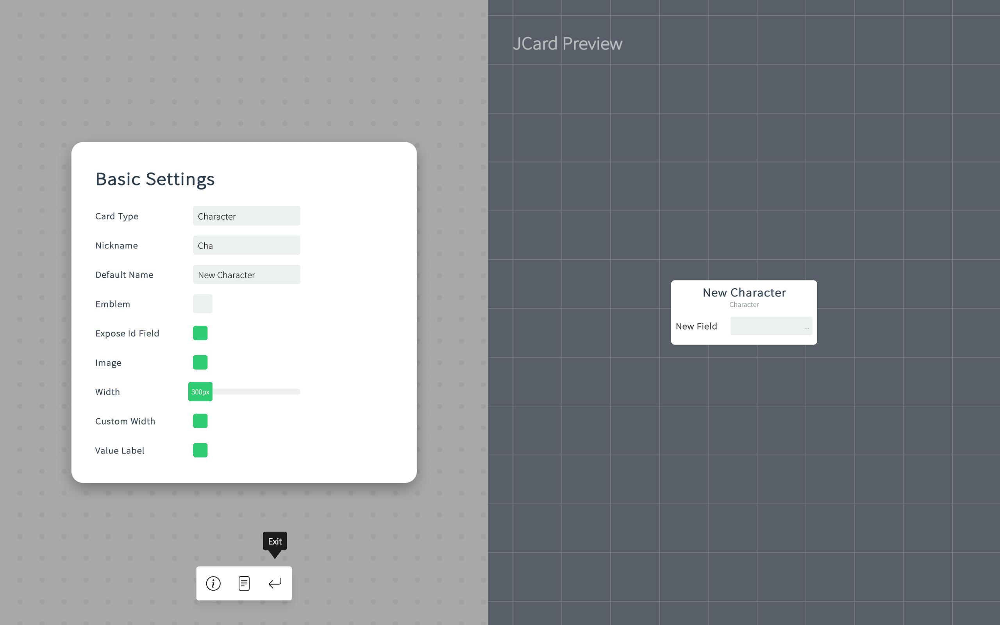

# JCard Documentation

## 1. Introduction to JCards

**JCards** are customizable cards used in the project. You can create JCards with custom fields, adjusting their type, text fields, icons, tags, and symbols for various settings. Here are different ways to use JCards:

**In a Board Game**: 

**Class Diagram**：

------

## 2. Creating a JCard

### 2.1 Steps to Create a JCard from Scratch

1. Open the standard board.
2. Click "Create JCard" from the **Object Creator Bar**.
3. Enter the name for your JCard, e.g., "Character".
4. Press "Create".

> Creating new "Character" JCard

The **JCard Template Window** will automatically open after creating the JCard. We will discuss its functionality later. You can click "Exit" to close it for now.

> Press the "Exit" button to return to main menu

Now, your JCard's icon will appear on the **Object Creator Bar**. You can drag the icon to create a new JCard based on that template.

------

## 3. Managing JCard Templates

### 3.1 Accessing the JCard Template Window

In this section, you can set the template information for the JCard. Templates define the settings for each JCard.

To open the template window, click the JCard icon on the **Object Creator Bar**, then click "Edit Template".

Each JCard created from a template is referred to as a "JCard". The template itself will be called "JCard Template".

### 3.2 Basic Settings Overview

This panel contains the basic settings for the JCard. On the left are the setting fields, and on the right, you can preview real-time changes to the JCard.

- **Card Type**: Defines the category of the JCard, e.g., "Character", "Item", "Action".
- **Nickname**: Displayed in the **Object Creator Bar** for easy identification.
- **Default Name**: The initial name for a JCard when it is created.
- **Emblem**: An icon for this JCard. All JCards created from this template will share the same emblem.
- **Expose Id Field**: Every JCard has an ID field, primarily used for exporting and importing JCards to CSV.
- **Image**: Enable this option to display images on the JCard.
- **Width**: The default width of the JCard.
- **Custom Width**: If enabled, allows each JCard to have a different width; otherwise, all JCards will adhere to the default width setting.
- **Value Label**: A small text field located in the top right corner of the JCard.

### 3.3 Configuring Text Field Settings

To modify text fields on the JCard:

1. Click on the bottom bar to access **Text Field Settings**.
2. Press "New Text Field" to add a new field.
3. Click on existing field names to edit them.

#### Visibility and Options

- The eye icon controls the visibility of each field.
- Click the area next to the visibility icon for options:
  - **Up/Down**: Change the order of text fields.
  - **Delete**: Remove the text field.

------

## 4. Customizing with Tags and Symbols

### 4.1 Adding Tags to JCards

Tags enhance customization and categorization.

#### 4.1.1 Creating Tags

Tags are text fields. For example, for a character, you might create tags like "Electric", "Ground", and "Fire". JCards can have no tags or an unlimited number of tags.

1. Click "Library".
2. Enter the Tag Name and choose a Color.
3. Click "Create".

#### 4.1.2 Editing Existing Tags

You can edit a tag after creation. All changes will apply to existing JCards.

1. Click "Library".
2. Select a tag.
3. Click "Edit".
4. Modify the tag name or color.

#### 4.1.3 Equipping Tags

1. Click "Edit".
2. In the "Tags" window, click the tags to equip them to the current JCard.
3. In the "Equipped" window, click the tags to unequip them from the current JCard.

### 4.2 Using Symbols

Symbols are icons. The processes for editing, equipping, and creating symbols are similar to those for tags. Please refer to the Tags documentation. [Insert link to tags documentation]

------

## 5. Importing and Exporting JCards

### 5.1 Importing a New JCard Template

You can import a CSV file to create a new JCard Template and its corresponding JCards efficiently.

#### Steps to Import a New JCard Template

You can import a CSV to create a new JCard Template and its corresponding JCards. This is a fast way to create JCards if you already have a table of cards.

To import and create a new JCard:

1. Open the standard board.
2. Click "Create JCard" from the **Object Creator Bar**.
3. Click "Import CSV" and select the desired CSV file.

The **JCard Import Window** will appear.

### 5.2 Import Settings Configuration

On the left side, you will see the import settings:

- **Card Type**: The JCard's type.
- **Id Column**: Column index for the ID.
- **Name Column**: Column index for the Name.
- **Custom Start Row**: Adjust this if the actual data in the CSV does not start at row 0.
- **Custom End Row**: Set this to limit the number of rows used for generating JCards.
- **Image Column**: Column index for the Image. The name of the image must match an imported image in the project.
- **Value Label Column**: Column index for the Value Label. Automatically populates the JCard's Value Label field.
- **Tag Column**: Column index for Tag. Automatically populates the JCard's Tag field. Existing tags will be used if available; otherwise, new tags will be created.
- **Symbol Column**: Column index for Symbol. Follows the same logic as the Tag Column.
- **Decoding**: Select different CSV decoding methods.

Any unspecified columns will automatically be used for generating the text fields of the JCard.

If there are errors in your settings, an error message will appear. Common errors include:

- "Duplicate ID Found": Each card must have a unique ID.
- "Same Column Name Found": All column names must be different.

On the right side, you can preview the CSV data.

The **JCard Preview** shows an example of the JCard created using the import settings. Click the reload icon to regenerate the example JCards if there are no errors.

Once all errors are resolved, click "Import" to import the JCards.

## 5.3 Importing into an Existing JCard

You can also import a CSV into an existing JCard to modify them in bulk using tools like Google Sheets or Microsoft Excel. For example, you can easily increase the "Attack" field of a "Character" JCard by +1.

To import a CSV into an existing JCard:

1. Select the JCard from the **Object Creator Bar** that you want to modify.
2. Press "Import CSV".

The **JCard Template Window** will open, allowing you to adjust settings.

After making adjustments, press "Import".

#### Handling Column Conflicts

If the number of columns differs between the existing JCard Template and the new Template, a conflict window will appear, allowing you to decide which text fields to use for the new JCard.

### 5.4 Conflict Resolution Scenarios

1. **Importing JCard A to JCard B**:
   - JCard A: [Health:10] [Attack:20] [Defense:30]
   - JCard B: [Attack:50] [Health:60] [Defense:70]
   - Result: JCard Z: [Attack:10] [Health:20] [Defense:30]
2. **Importing JCard B to JCard C**:
   - JCard B: [Health:10] [Attack:20] [Defense:30]
   - JCard C: [Attack:50] [Health:60]
   - Result: JCard Z: [Attack:10] [Health:20]
3. **Importing JCard C to JCard B**:
   - JCard C: [Attack:50] [Health:60]
   - JCard B: [Health:10] [Attack:20] [Defense:30]
   - Result: JCard Z: [Health:50] [Attack:60] [Defense: ]

AS seen from scenario 1,  the way it resolves conflict is by the **order** of the text fields, and not by the name. 

From scenario 2, information of the original JCard B will be lost if the number of text fields is less.

From scenario 3, all of JCard C's information is imported while maintaining the text fields. However, all of the existing text fields will be cleared.

### 5.5 Managing Existing JCard IDs

If a JCard with the same ID exists, you can choose one of the following options:

- **Keep Original**: Do not import the new JCard.
- **Keep New**: Replace the original JCard with the new one.
- **Keep Both**: Retain the original JCard and create a new one with a new ID and values.

